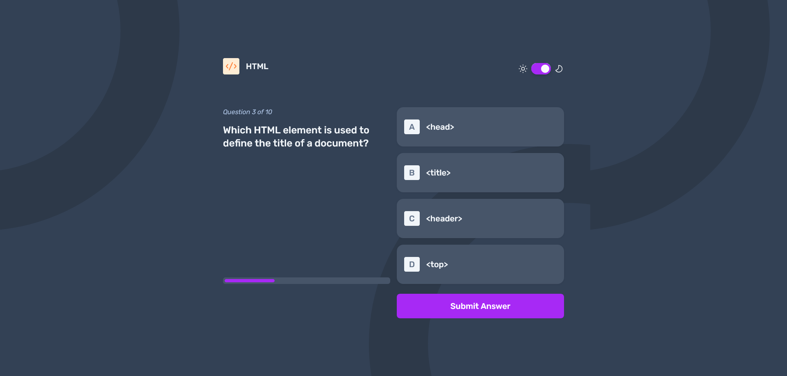

# Frontend Mentor - Frontend quiz app solution

This is a solution to the [Frontend quiz app challenge on Frontend Mentor](https://www.frontendmentor.io/challenges/frontend-quiz-app-BE7xkzXQnU). Frontend Mentor challenges help you improve your coding skills by building realistic projects.

## Table of contents

- [Overview](#overview)
  - [The challenge](#the-challenge)
  - [Screenshot](#screenshot)
  - [Links](#links)
- [My process](#my-process)
  - [Built with](#built-with)
  - [What I learned](#what-i-learned)
  - [Continued development](#continued-development)
  - [Useful resources](#useful-resources)
- [Author](#author)
- [Acknowledgments](#acknowledgments)

## Overview

### The challenge

Users should be able to:

- Select a quiz subject
- Select a single answer from each question from a choice of four
- See an error message when trying to submit an answer without making a selection
- See if they have made a correct or incorrect choice when they submit an answer
- Move on to the next question after seeing the question result
- See a completed state with the score after the final question
- Play again to choose another subject
- View the optimal layout for the interface depending on their device's screen size
- See hover and focus states for all interactive elements on the page
- Navigate the entire app only using their keyboard
- **Bonus**: Change the app's theme between light and dark

### Screenshot

### Links

- Solution URL: [Solution](https://www.frontendmentor.io/solutions/react-tailwind-frontend-quiz-eEwBagmZnE)
- Live Site URL: [Live site]([https://your-live-site-url.com](https://neon-dusk-40b96c.netlify.app/))

## My process

1. Before i started, i look through the design files in figma. after that i determine what kind of thing i want to practice. as result i want to practice my react skill. i decide to use react as frontend framework and tailwindcss ass CSS framework to minimize jumping between style.
2. i first write html structure in one big file before dividing it into multiple file. Using tailwind make it faster to code UI. At this time i finished creating Welcome page.
3. I create the remainder component such as QuizItem, QuizList, ViewMode, AnswerList, AnswerItem.
4. After most of UI has been made i start creating state variable such as title to track which quiz topic picked, number to track which question and answer being displayed, score to track how many correct answer user made.
5. To make it work i render component based on state, for example when in welcome screen, the question and answer not rendered because title state is not currently set.
6. The flow of app is, first user being displayed welcome screen, then user pick a topic a question and list of answer displayed, user choose answer and click submit answer then the right and wrong answer get shown, after doing it to question 10 the score displayed.

### Built with

- [React](https://reactjs.org/) - JS library
- [Tailwind CSS](https://tailwindcss.com/) - Open source CSS Framework
- Mobile-first workflow

### What I learned

There is so much i learn by doing this project. to name a few as follow:

1. Having a requirement and design files before starting to code make it certainly the project being completed. because i know what i must do from start to finish.

2. From the design files i know what technology to choose to work on the project.

3. Using tailwind make it easy to style react component

4. When working on state i often encounter component not get updated even when the state changed. I struggle to set the selected state when user try to choose an answer. After many tried and failure i successfully overcome by creating an array of isSelected set to false. whenever user pick new answer all of item in array get set to false before setting it to true based on answer user picked.

5. What is often become a struggle is to decide if the state should live within component or on parent. I struggle on placing isSelected state. i try passing it as props from parent by computing it from another prop which make it all selected when i select answer, creating the state inside component make it looks like multiple answer is selected.

6. Another problem regarding props is how many and what kind of props should i pass. By working on this project i started seeing pattern on what props to be passed.

7. When passing props, if props seem related and looks like data to be displayed. it's better to wrap it inside object so i don't need to write too many props

8. I have problem on how to display icon from data. the solution is i copy the data into js file and import icon file from there.

9. Using tailwind make it easier to set style based on state. One helpful example is creating style for selected, correct, wrong, normal state.

10. Implementing dark mode is easy on tailwind. all i had to do is to prefix the style with `dark:`. To make dark mode controlled by toggler i have to edit tailwind config to set darkMode properties to `class`. Then make darkMode state to toggle light on dark mode.

11. To make the toggler switcher i search it on UIverse. UIVerse provide code in CSS and Tailwind. Saving lot of time.

12. Setting background imake based on breakpoint in tailwind is quite confusing at first. But i manage to do it by adding custom backgroundImage properties in tailwin config file. and use it with `bg-[properties-name]` like `bg-patternDesktopLight`

13. Before i work on this project i learn react by reading the first 2 section of learn react on [React.dev](https://react.dev) that is Describing the UI and Adding Interactivity

### Continued development

In the future i want to load the data from a database such as MySQL, and add more quiz topic

### Useful resources

- [UIverse](https://uiverse.io) - This website helped me find component that seems to need lot of styling like toggle switcher
- [React.dev](https://react.dev) - This website provide great starting point on learning react. It provide core concept and practice at the end of page.
- [Tailwindcss](https://tailwindcss.com/) - This tailwindcss documentation provide great information about getting started on using tailwindcss, learning the core concept, looking for detailed information of specific style.
- [Dark Mode with TailwindCSS](https://youtu.be/NxIBnvb8B7Y?list=LL) - this youtube video helped me getting started on implementing dark mode in tailwind
- [Dark Mode](https://v2.tailwindcss.com/docs/dark-mode) - This tailwind documentation show the right way to configure dark mode

## Author

- Frontend Mentor - [@Odiesta](https://www.frontendmentor.io/profile/Odiesta)
- X - [@OdiestaS](https://x.com/OdiestaS)

## Acknowledgments

I grateful on having to work on this project. My react and tailwind skill increase greatly. I would like to thank frontendmentor for creating frontend-quiz-app challenge.
